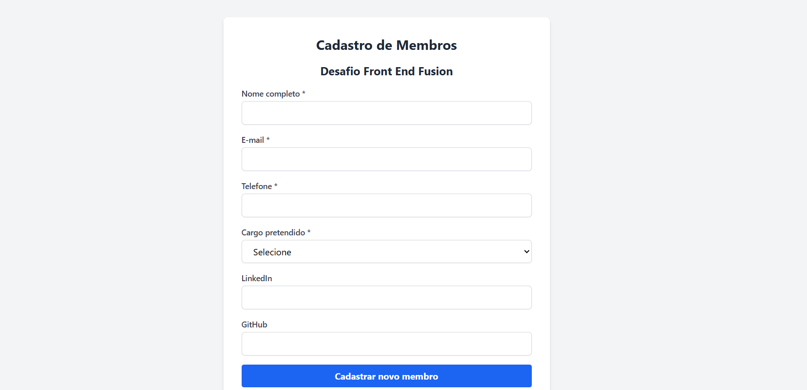

## Formulário com Validação

Uma aplicação web de preenchimento de formulário construída com React, como parte do desafio do Projeto FrontEnd Fusion, com o objetivo de criar um formulário de cadastro de membros com validação e persistência local.

### ✨ Funcionalidades
- ✅ Cadastro de novos membros com:
  - Nome completo
  - E-mail (com validação de formato)
  - Telefone
  - Cargo pretendido (seleção entre 15 opções)
  - LinkedIn (opcional)
  - GitHub (opcional)
- ✅ Validação de todos os campos obrigatórios
- ✅ Armazenamento dos dados localmente (localStorage)
- ✅ Exibição de mensagens de sucesso ou erro
- ✅ Botão para visualizar todos os cadastros já realizados

### 💻 Tecnologias Utilizadas
- React
- Tailwind CSS
- React Hook Form
- Zod (validação de dados)
- localStorage (armazenamento)

### 📦 Instalação
- Clone o repositório:
```bash
git clone https://github.com/elanealencar/formulario-com-validacao-frontend.git
cd seu-repo
```

- Instale as dependências:
```bash
npm install
```

- Inicie o servidor de desenvolvimento:
```bash
npm run dev
```

A aplicação estará disponível em http://localhost:5173


## 🗂️ Estrutura de Pastas
```css
src/
├── components/
│   ├── Form.jsx
│   └── CadastroList.jsx
├── App.jsx
├── main.jsx
└── index.css
```

## 📱 Layout

A interface é responsiva, com design simples e direto, utilizando Tailwind CSS para estilização e adaptação em diferentes dispositivos.

## 💬 Mensagens de Feedback

- Sucesso: "✅ Cadastro realizado com sucesso!"
- Erro: "❌ Falha ao cadastrar. Verifique os dados informados."
- Visualização: botão para exibir ou ocultar cadastros salvos

## 📸 Preview

- [Visualizar o Projeto](https://)



## Criado por:

Elane Alencar
- [Linkedin](https://linkedin.com/in/elanealencar)
- [Portfólio](https://portfolio-elanealencar.vercel.app/)
